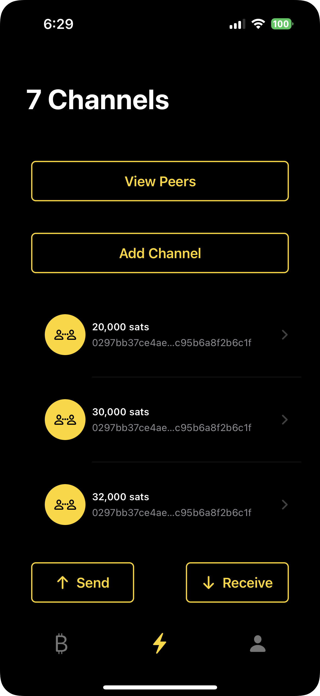

# Monday

 

An example iOS app using [ldk-node](https://github.com/lightningdevkit/ldk-node)

## Functionality

This app is an experimental work in progress. 

It provides default implementations for: 
- testnet
- regtest *via [tnull](https://github.com/tnull/ldk-node-workshop)*
- signet *via [mutiny-net](https://github.com/MutinyWallet/mutiny-net)*

### Implemented

- [x] Start Node `start`

- [x] Stop Node `stop`

- [x] Node ID `nodeId`

- [x] Wallet Address `newFundingAddress`

- [x] Spendable Balance `getSpendableOnchainBalanceSats`

- [x] Total Balance `getTotalOnchainBalanceSats`

- [x] Connect Peer `connect`

- [x] Disconnect Peer `disconnect`

- [x] Open Channel `connectOpenChannel`

- [x] Close Channel `closeChannel`

- [x] Send `sendPayment`

- [x] Receive `receivePayment`

- [x] List Peers `listPeers`

- [x] List Channels `listChannels`

### Not Implemented

- [ ] Event Handling 

- [ ] All Payment variations

## Swift Packages

- ldk-node (version 0.1-alpha.1)

- Bitcoin UI Kit via [WalletUI](https://github.com/reez/WalletUI)

- QR Code Scanner via [Code Scanner](https://github.com/twostraws/CodeScanner)

## Thanks

[@notmandatory](https://github.com/notmandatory) for getting this up and running with me on a Monday.

[@tnull](https://github.com/tnull) most importantly. 

The [Lightning Dev Kit](https://lightningdevkit.org) team/project and the [Bitcoin Dev Kit](https://bitcoindevkit.org/) team/project, `ldk-node` is built using both.
