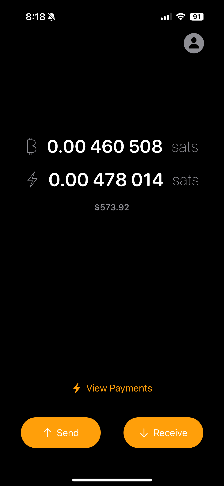

# Monday

 

An example iOS app using [LDK Node](https://github.com/lightningdevkit/ldk-node).

## Functionality

*This app is an experimental work in progress.*

A lightning node on your iPhone with the ability to send & receive on-chain & lightning over any network.

## Swift Packages

- LDK Node via [ldk-node](https://github.com/lightningdevkit/ldk-node)

  *Note: Sometimes, a [local build of LDK Node](https://github.com/lightningdevkit/ldk-node/blob/main/scripts/uniffi_bindgen_generate_swift.sh) is used instead of the remote Swift package.*

- Bitcoin UI Kit via [BitcoinUI](https://github.com/reez/BitcoinUI)

- QR Code Scanner via [Code Scanner](https://github.com/twostraws/CodeScanner)

- Keychain via [Keychain Access](https://github.com/kishikawakatsumi/KeychainAccess)

## Thanks

[@notmandatory](https://github.com/notmandatory) for getting this up and running with me on a Monday.

[@tnull](https://github.com/tnull) most importantly. 

The [Lightning Dev Kit](https://lightningdevkit.org) team/project and the [Bitcoin Dev Kit](https://bitcoindevkit.org/) team/project, LDK Node is built using both.
