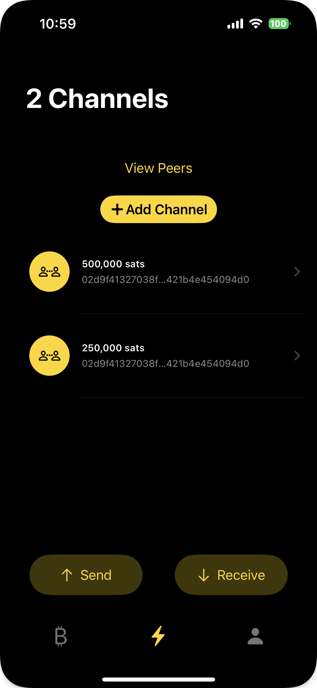

# Monday

 

An example iOS app using [LDK Node](https://github.com/lightningdevkit/ldk-node)

## Functionality

This app is an experimental work in progress. 

### Implemented

- [x] `start`

- [x] `stop`

- [x] `nodeId`

- [x] `newOnchainAddress`

- [x] `spendableOnchainBalanceSats`

- [x] `totalOnchainBalanceSats`

- [x] `connect`

- [x] `disconnect`

- [x] `connectOpenChannel`

- [x] `closeChannel`

- [x] `sendPayment`

- [x] `receivePayment`

- [x] `listPeers`

- [x] `listChannels`

- [x] `sendAllToOnchainAddress`

- [x] `listPayments`

- [x] `nextEvent` 

- [x] `eventHandled` 

## Swift Packages

- LDK Node via [ldk-node](https://github.com/lightningdevkit/ldk-node)

- Bitcoin UI Kit via [BitcoinUI](https://github.com/reez/BitcoinUI)

- QR Code Scanner via [Code Scanner](https://github.com/twostraws/CodeScanner)

- Keychain via [Keychain Access](https://github.com/kishikawakatsumi/KeychainAccess)

## Thanks

[@notmandatory](https://github.com/notmandatory) for getting this up and running with me on a Monday.

[@tnull](https://github.com/tnull) most importantly. 

The [Lightning Dev Kit](https://lightningdevkit.org) team/project and the [Bitcoin Dev Kit](https://bitcoindevkit.org/) team/project, LDK Node is built using both.
